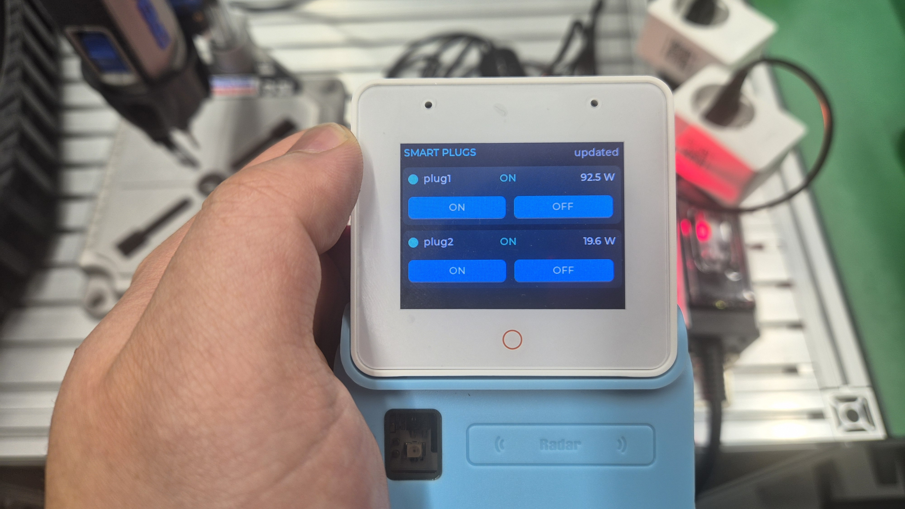
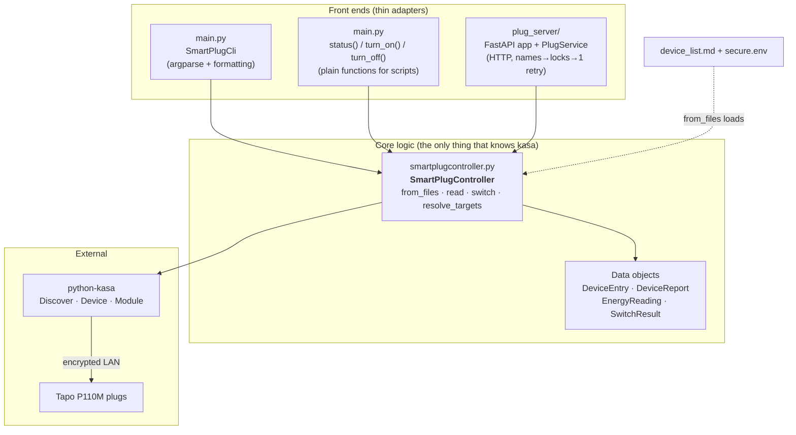
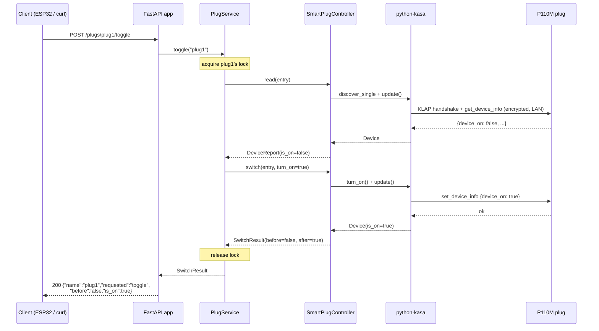

# python-smart-plug

> Read, monitor, and switch **TP-Link Tapo P110M** smart plugs from Python —
> over the command line, from your own scripts, or over HTTP (so an ESP32 or
> any other LAN device can control them too).

This repository is a small, well-layered application built on top of the
[python-kasa](https://github.com/python-kasa/python-kasa) library. It is meant
to be approachable even if you have **never heard of the P110M or python-kasa**:
this README explains the hardware, the network protocol, and how every piece of
the code fits together, with diagrams.

---

## Demo

An **ESP32-S3 with a touchscreen** (firmware in [docs/esp32s3/](docs/esp32s3/))
calling this project's HTTP server to read and switch the plugs live — no PC in
the loop:

[](media/demo.mp4)

> The handheld screen lists each plug, its live power draw (`plug1` 92.5 W,
> `plug2` 19.6 W), and ON/OFF buttons. Tapping a button sends
> `POST /plugs/{name}/on|off` to the FastAPI server, which drives the real plug
> over the LAN. **▶ Click the image above to play the [demo video](media/demo.mp4).**

This is the full stack in action: touchscreen → HTTP → `SmartPlugController` →
python-kasa → P110M. The sections below explain every hop.

---

## Table of contents

1. [What you get](#1-what-you-get)
2. [Background: the P110M and python-kasa](#2-background-the-p110m-and-python-kasa)
3. [How the plug talks to your computer](#3-how-the-plug-talks-to-your-computer)
4. [Repository layout](#4-repository-layout)
5. [Code architecture (the layers)](#5-code-architecture-the-layers)
6. [Setup](#6-setup)
7. [Usage — command line](#7-usage--command-line)
8. [Usage — from Python](#8-usage--from-python)
9. [Usage — HTTP server](#9-usage--http-server)
10. [The energy-meter gotcha](#10-the-energy-meter-gotcha)
11. [End-to-end: what happens on one request](#11-end-to-end-what-happens-on-one-request)
12. [Troubleshooting](#12-troubleshooting)
13. [Project conventions and further docs](#13-project-conventions-and-further-docs)

---

## 1. What you get

```text
                ┌───────────────────────────────────────────────┐
                │                Three ways in                  │
                └───────────────────────────────────────────────┘

   $ python main.py on plug1        import main                  HTTP POST
   $ python main.py status          main.status("plug1")         /plugs/plug1/on
        (terminal CLI)              (your own script)            (ESP32 / curl / app)
            │                            │                            │
            └──────────────┬─────────────┴──────────────┬────────────┘
                           ▼                             ▼
                  ┌──────────────────────────────────────────────┐
                  │            SmartPlugController               │
                  │  (the one class that knows how to talk to    │
                  │   the plugs: connect, auth, read, switch)    │
                  └──────────────────────────────────────────────┘
                           │  uses the python-kasa library
                           ▼
                  ┌──────────────────────────────────────────────┐
                  │      Tapo P110M plugs on your Wi-Fi LAN       │
                  │      plug1 @ 192.168.1.239   plug2 @ .79      │
                  └──────────────────────────────────────────────┘
```

Concretely, you can:

- **See status** — on/off state, live power (W), today/month energy (kWh),
  voltage, current, plus serial number, firmware, and model.
- **Switch** — turn a plug `on`/`off`/`toggle`, addressed by a friendly name
  (`plug1`), by IP, or `all` at once.
- **Automate** — call plain Python functions, or run a small **FastAPI** HTTP
  server so non-Python devices (an ESP32-S3 is the original use case) can drive
  the plugs over the network.

---

## 2. Background: the P110M and python-kasa

**If these terms are new, read this section first.**

### The TP-Link Tapo P110M

The **P110M** is a Wi-Fi smart plug: a wall socket you can switch on/off
remotely, and which **measures the power** flowing through it (an "energy
monitoring" plug). "M" denotes the Matter-capable revision; this project drives
it through TP-Link's own protocol, not Matter.

| Property            | Value in this repo                          |
|---------------------|----------------------------------------------|
| Model               | Tapo **P110M**                               |
| Hardware / firmware | HW 1.0 (KR) / FW 1.2.2                        |
| Protocol family     | **SMART** (the newer, encrypted Tapo stack)  |
| Measures            | power (W), energy (kWh), voltage (V), current (A) |

### python-kasa

[`python-kasa`](https://github.com/python-kasa/python-kasa) is an open-source
**asyncio** Python library + CLI for TP-Link Kasa **and** Tapo devices. It hides
the wire protocol behind a clean object model:

```python
dev = await Discover.discover_single("192.168.1.239", credentials=creds)
await dev.update()          # fetch a fresh snapshot of everything
dev.is_on                   # -> True / False
await dev.turn_on()         # switch the relay
dev.modules[Module.Energy]  # power / energy readings
```

This repo pins it as a git submodule under [external/python-kasa](external/python-kasa)
and is verified against **kasa 0.10.2**.

> **Kasa vs. Tapo, "SMART" protocol.** Older *Kasa* devices speak a simple,
> unauthenticated local protocol. Newer *Tapo* devices (including the P110M)
> speak the **SMART** protocol, which is **encrypted and requires your TP-Link
> cloud account credentials** to open a session — even though the actual control
> traffic stays on your local network. That is why this project needs a
> username/password (see [Setup](#6-setup)).

---

## 3. How the plug talks to your computer

A common misconception: "smart plug + cloud account" must mean your commands go
out to the internet and back. **They do not.** Once the plug is on your Wi-Fi,
this project talks to it **directly over the LAN**. The cloud account is used
only to *prove who you are* during an encrypted local handshake.

```text
   ┌─────────────────────┐                         ┌──────────────────────┐
   │   Your computer     │                         │   Tapo P110M plug    │
   │  (this project)     │                         │   192.168.1.239      │
   └─────────┬───────────┘                         └──────────┬───────────┘
             │                                                │
             │  1. Discover/identify the device               │
             │ ─────────────────────────────────────────────► │
             │     "what are you, and how do you encrypt?"     │
             │ ◄───────────────────────────────────────────── │
             │                                                │
             │  2. KLAP handshake (encrypted)                  │
             │     proves we own the TP-Link account, then     │
             │     derives a per-session AES key — all local   │
             │ ◄────────────────────────────────────────────► │
             │                                                │
             │  3. Encrypted requests over the LAN (HTTP/TCP)  │
             │     get_device_info / get_energy_usage          │
             │     set_device_info {device_on: true}           │
             │ ◄────────────────────────────────────────────► │
             │                                                │
             │  4. disconnect (close the session)              │
             │ ─────────────────────────────────────────────► │
   ┌─────────┴───────────┐                         ┌──────────┴───────────┐
   │  No cloud round-trip│                         │  Relay flips, emeter │
   │  in the data path   │                         │  updates ~1×/second  │
   └─────────────────────┘                         └──────────────────────┘
```

What python-kasa does for us at each step:

| Step | python-kasa call (used in this repo)                  | What happens on the wire |
|------|-------------------------------------------------------|--------------------------|
| 1    | `Discover.discover_single(ip, credentials=...)`       | Probe the host, learn its type and encryption scheme, return a `Device` |
| 2    | (inside the call above) the KLAP handshake            | Local, encrypted key exchange authenticated by your cloud credentials |
| 3a   | `await dev.update()`                                  | Pull a full snapshot: state, energy, firmware, MAC, model |
| 3b   | `await dev.turn_on()` / `await dev.turn_off()`        | Send a "set relay" command |
| 4    | `await dev.disconnect()`                              | Tear the session down |

> **Why credentials at all, if it is local?** The plug was bound to your TP-Link
> account when you set it up in the Tapo app. The SMART protocol refuses an
> unauthenticated session, so even a purely local controller must present those
> same credentials. They are sent only into the encrypted handshake and are
> **never printed** by this project.

---

## 4. Repository layout

```text
python-smart-plug/
├── main.py                  ← CLI + plain Python functions (the thin front end)
├── smartplugcontroller.py   ← SmartPlugController: ALL device logic lives here
├── device_list.md           ← your plugs (name, MAC, IP) — the source of truth
├── secure.env               ← your TP-Link credentials (gitignored, never committed)
│
├── plug_server/             ← optional FastAPI HTTP server
│   ├── app.py               ←   routes + FastAPI wiring
│   ├── service.py           ←   PlugService: name lookup, per-plug locks, 1 retry
│   └── models.py            ←   Pydantic JSON response shapes
├── run_server.sh            ← launches the server in the conda env on :17046
│
├── docs/
│   └── esp32s3/             ← ESP32-S3 firmware + integration guide for the API
├── claude_test/             ← throwaway diagnostic scripts (not CI tests)
│
├── external/
│   ├── python-kasa/         ← the upstream library (git submodule)
│   └── CommonClaude/        ← shared conventions (git submodule)
│
├── CLAUDE.md                ← coding/Git conventions for this repo
├── ToDo.md                  ← append-only task history
└── LearnedPatterns.md       ← lessons learned (e.g. the emeter lag)
```

The two files you will actually edit to point this at *your* plugs are
[device_list.md](device_list.md) and `secure.env`. Everything else is logic.

### `device_list.md` — the single source of truth

It is a plain CSV table (the header row is skipped). One row per plug:

```text
devicetype, name, mac_address, ip_address
tapo p110m, plug1, 18-69-45-71-05-2F, 192.168.1.239
tapo p110m, plug2, 18-69-45-71-02-7C, 192.168.1.79
```

- **name** is how you address the plug everywhere (`plug1`, `plug2`, …).
- **ip_address** is how the code reaches it. Give your plugs **static/reserved
  IPs** in your router so these do not drift.
- **mac_address** is used as a sanity check: a status report flags a
  `MISMATCH with device_list` if the plug at that IP reports a different MAC.

---

## 5. Code architecture (the layers)

The design rule of this repo: **all device logic is in one class**
(`SmartPlugController`), and every front end (CLI, scripts, HTTP) is a thin
adapter on top of it. Nothing outside the controller touches python-kasa.



### 5.1 `SmartPlugController` — the engine

Built once via `SmartPlugController.from_files()`, which:

1. reads credentials (`secure.env` → `KASA_USERNAME` / `KASA_PASSWORD`), and
2. parses `device_list.md` into a list of `DeviceEntry` objects.

Then you call its coroutines. Every call **connects fresh, acts, and
disconnects** — there is no long-lived connection to leak:

| Method                         | What it does |
|--------------------------------|--------------|
| `read(entry)`                  | Connect → `update()` → return a `DeviceReport` (state + energy + identity) |
| `read_all()`                   | `read` every device **concurrently** (`asyncio.gather`) |
| `switch(entry, turn_on=...)`   | Connect → record `before` → flip relay → re-`update()` → return `SwitchResult` |
| `switch_many(...)`             | `switch` several devices concurrently |
| `resolve_targets("plug1")`     | Map a name / IP / `"all"` to the matching `DeviceEntry` list |
| `read_energy(dev)` *(static)*  | Pull the Energy module **defensively** (each field may be unsupported) |
| `read_firmware(dev)` *(static)*| Prefer the Firmware module, fall back to `hw_info["sw_ver"]` |

Results come back as **plain data objects**, so no caller ever needs to know
about python-kasa:

```text
DeviceReport                         SwitchResult
 ├─ entry     (DeviceEntry)           ├─ entry   (DeviceEntry)
 ├─ is_on     (bool | None)           ├─ before  (bool | None)
 ├─ energy    (EnergyReading | None)  ├─ after   (bool | None)
 ├─ serial / firmware / model / mac   └─ error   (str | None)
 ├─ error     (str | None)            └─ .ok  →  error is None
 └─ .ok  →  error is None
```

Errors are **returned, not raised**: a failed read produces a `DeviceReport`
with `.ok == False` and a human-readable `.error`, so one unreachable plug never
aborts a batch.

### 5.2 `main.py` — CLI and script functions

Two front ends share the controller:

- **`SmartPlugCli`** — parses `status` / `on` / `off` / `demo`, formats reports
  into readable terminal blocks, and returns a process exit code.
- **`status()` / `turn_on()` / `turn_off()`** — synchronous wrappers (each runs
  its own `asyncio.run`) that return the data objects, for use from a REPL or
  another script.

### 5.3 `plug_server/` — the HTTP layer

For non-Python clients. `PlugService` adds exactly three things the controller
does not provide on its own:

- a **name index** (address plugs by `device_list.md` name in the URL),
- a **per-plug `asyncio.Lock`** (two requests for the *same* plug never open
  competing sessions; different plugs still run in parallel), and
- **one automatic retry** on a transient device failure (a Tapo session can
  expire; retrying is safe because on/off are absolute, idempotent commands).

Typed errors map to HTTP codes (`UnknownPlugError`→404, `EnergyUnsupportedError`
→422, `PlugDeviceError`→502).

---

## 6. Setup

### Prerequisites

- Python **3.12** (the project uses a conda env named `smartplug`).
- Your P110M plugs already set up in the **Tapo mobile app** and on the **same
  LAN** as this machine, with known IPs.
- Your TP-Link / Tapo **account email + password**.

### 6.1 Create the environment

```bash
# Create and populate the conda env this project expects.
conda create -n smartplug python=3.12 -y
conda run -n smartplug pip install python-kasa fastapi "uvicorn[standard]"
```

> Everything in this project runs **inside that env**. Prefix commands with
> `conda run -n smartplug …` (the `conda` shell function is not available in
> non-interactive shells, so the explicit form is the reliable one).

### 6.2 Provide your credentials

Create `secure.env` in the repo root (it is **gitignored** — never commit it):

```bash
export KASA_USERNAME=you@example.com
export KASA_PASSWORD=your-tplink-password
```

The controller loads this file automatically; you do **not** need to `source`
it. Already-exported shell variables of the same name win, so CI/secret managers
can override the file.

### 6.3 List your plugs

Edit [device_list.md](device_list.md) so the rows match *your* plugs' names,
MACs, and IPs (format shown in [§4](#device_listmd--the-single-source-of-truth)).

### 6.4 Verify it works

```bash
conda run -n smartplug python main.py status
```

You should see one block per plug with state and power. If not, jump to
[Troubleshooting](#12-troubleshooting).

---

## 7. Usage — command line

```bash
# Status of every plug (this is the default command).
conda run -n smartplug python main.py
conda run -n smartplug python main.py status

# Switch by name, by IP, or all at once.
conda run -n smartplug python main.py on  plug1
conda run -n smartplug python main.py off 192.168.1.79
conda run -n smartplug python main.py on  all

# Run the built-in demo (reads status, toggles plug1, restores it).
conda run -n smartplug python main.py demo
```

Example `status` output for one plug:

```text
plug1 (tapo p110m) @ 192.168.1.239
  state:              ON
  power (now):        91.5 W
  energy (today):     0.123 kWh
  energy (month):     2.456 kWh
  voltage / current:  229.7 V / 0.415 A
  serial (device_id): 802D...E1
  firmware:           1.2.2 Build 240422 Rel.183947
  model:              P110M
  mac:                18:69:45:71:05:2F  (matches device_list)
```

`on`/`off` print a `BEFORE -> AFTER` transition per plug and exit non-zero if any
target failed, so the commands compose in scripts.

---

## 8. Usage — from Python

```python
import main

# Read — returns a list of DeviceReport objects.
for report in main.status("all"):
    if report.ok:
        watts = report.energy.power_w if report.energy else None
        print(report.entry.name, report.is_on, watts)
    else:
        print(report.entry.name, "ERROR:", report.error)

# Switch — returns a list of SwitchResult objects.
main.turn_on("plug1")
main.turn_off("plug1")
```

For repeated calls, build the controller once and pass it in to avoid re-reading
config each time:

```python
from smartplugcontroller import SmartPlugController

controller = SmartPlugController.from_files()
main.status("plug1", controller=controller)
main.turn_on("plug1", controller=controller)
```

---

## 9. Usage — HTTP server

Start the server (binds `0.0.0.0:17046` so any LAN client can reach it):

```bash
./run_server.sh
# or:  conda run -n smartplug uvicorn plug_server.app:app --host 0.0.0.0 --port 17046
```

Interactive API docs are then at `http://<this-machine-ip>:17046/docs`.

### The HTTP contract

State changes use **POST**; reads use **GET** (so a stray GET can never toggle a
plug). `{name}` is a name from `device_list.md`.

| Method | Path                    | Purpose                          | Success |
|--------|-------------------------|----------------------------------|---------|
| GET    | `/health`               | Liveness + configured plug count | 200 |
| GET    | `/plugs`                | List plugs (no device contact)   | 200 |
| GET    | `/plugs/{name}`         | Live on/off state + identity     | 200 |
| POST   | `/plugs/{name}/on`      | Turn the plug on                 | 200 |
| POST   | `/plugs/{name}/off`     | Turn the plug off                | 200 |
| POST   | `/plugs/{name}/toggle`  | Flip to the opposite state       | 200 |
| GET    | `/plugs/{name}/energy`  | Power / energy snapshot          | 200 |

Error codes: `404` unknown plug · `422` plug has no energy meter · `502` device
unreachable / auth / timeout.

```bash
# Quick test with curl.
curl http://192.168.1.50:17046/health
curl http://192.168.1.50:17046/plugs/plug1
curl -X POST http://192.168.1.50:17046/plugs/plug1/on
curl http://192.168.1.50:17046/plugs/plug1/energy
```

Example `GET /plugs/plug1/energy` response:

```json
{
  "name": "plug1",
  "power_w": 91.5,
  "today_kwh": 0.123,
  "month_kwh": 2.456,
  "voltage_v": 229.7,
  "current_a": 0.415
}
```

A full client guide for embedded devices (Arduino-ESP32 and ESP-IDF), including
ready-to-flash firmware, lives under [docs/esp32s3/](docs/esp32s3/). The
[touchscreen demo](#demo) at the top of this README is exactly that firmware
calling these endpoints.

---

## 10. The energy-meter gotcha

**The P110M's energy meter lags the relay by ~4–6 seconds.** If you turn a plug
on and immediately read power, you will often still see `0 W`; turn it off and
you may still see the last "on" value for a few seconds. The meter only refreshes
about once per second and trails the relay state.

```text
  turn_on()        +1s        +3s        +5s        +7s
     │              │          │          │          │
  relay ON      meter 0W   meter 0W   meter ~ok   meter accurate
     ▼              ▼          ▼          ▼          ▼
  ░░░░░░░░░░░░ settle window (~6–7 s) ░░░░░░░░░░░░░  ← read power AFTER this
```

This is the **device's** behavior, not a library bug — `update()` faithfully
returns whatever the plug currently reports. **Rule of thumb:** after switching,
wait ~6–7 seconds before trusting a power reading. (Recorded in
[LearnedPatterns.md](LearnedPatterns.md) §Q3.)

---

## 11. End-to-end: what happens on one request

Tracing `curl -X POST .../plugs/plug1/toggle` all the way down:



The read and the switch happen **under the same per-plug lock**, so a toggle is
atomic with respect to other requests for that same plug.

---

## 12. Troubleshooting

| Symptom | Likely cause / fix |
|---------|--------------------|
| `Set both KASA_USERNAME and KASA_PASSWORD` | Only one credential is set. Fill in both in `secure.env`. |
| `Missing credentials …` | `secure.env` absent or empty, and the env vars are unset. |
| `Device not found or unsupported.` | Wrong IP, plug offline, or on a different subnet. Confirm the IP in your router and that this machine can reach it. |
| `AuthenticationError` in a report | Credentials do not match the account the plug is bound to. Re-check `secure.env`. |
| `MISMATCH with device_list` | The plug answering at that IP has a different MAC than your row — likely the IP was reassigned. Use static/reserved IPs. |
| Power reads `0 W` right after `on` | Expected — see [§10](#10-the-energy-meter-gotcha). Wait ~6–7 s. |
| `ModuleNotFoundError: kasa` / `fastapi` | You are not in the `smartplug` env. Prefix with `conda run -n smartplug …`. |
| Server unreachable from the ESP32 | It must bind `0.0.0.0` (it does) and the client must use this machine's **LAN IP**, not `localhost`; check the firewall on port 17046. |

---

## 13. Project conventions and further docs

- **[CLAUDE.md](CLAUDE.md)** — coding style (MIT comment style, 88-col Ruff),
  Conventional Commits, GitHub-Flow branching, and the task workflow this repo
  follows.
- **[ToDo.md](ToDo.md)** — append-only history of every task.
- **[LearnedPatterns.md](LearnedPatterns.md)** — accumulated gotchas (the emeter
  lag, credential handling, and more).
- **[docs/esp32s3/](docs/esp32s3/)** — ESP32-S3 firmware and the HTTP
  integration guide for the plug-control server.
- **[external/python-kasa](external/python-kasa)** — the upstream library
  (submodule, verified at v0.10.2).

> **Security note:** the HTTP server has **no authentication** by design — run it
> only on a trusted LAN. Never commit `secure.env`; it is gitignored for this
> reason.
